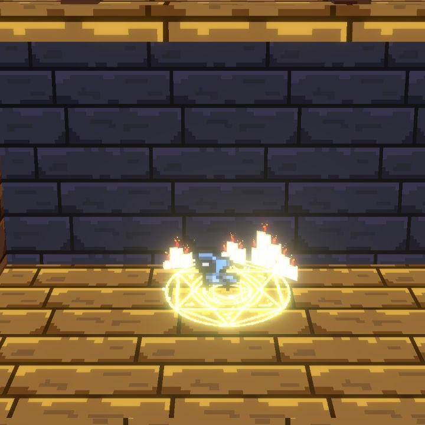
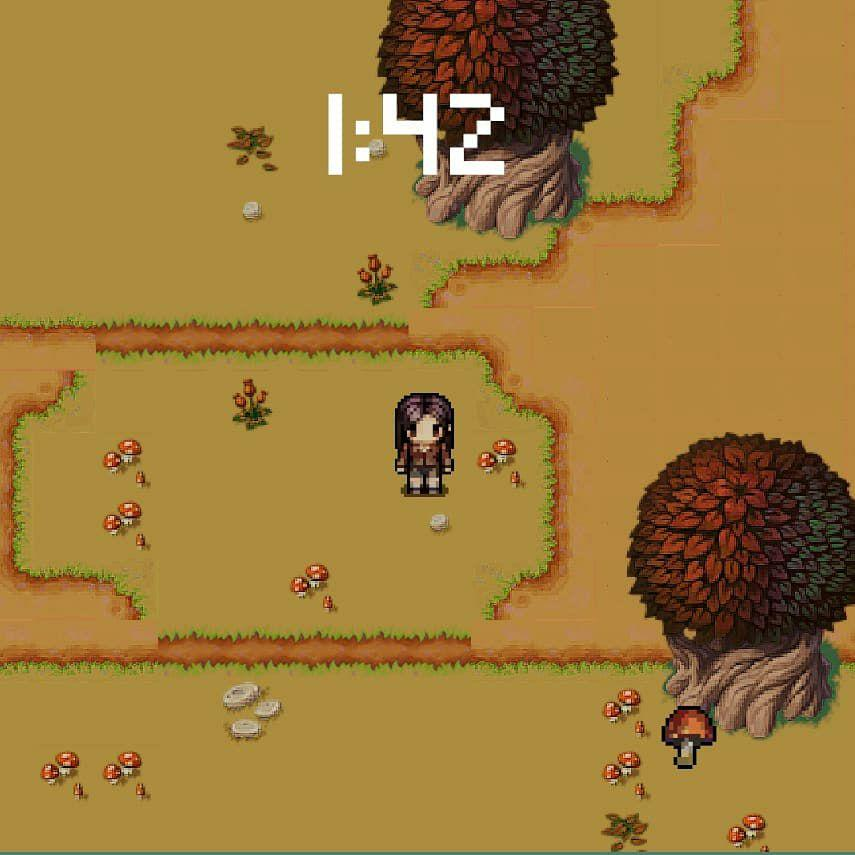
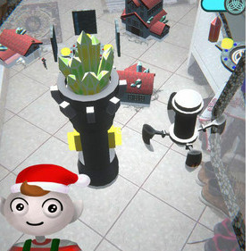

<h1> About me </h1>
I am a passionate game developer and an avid learner. I studied programming since high school and I've always been interested in game design. I have a bachelor degree in computer science engineering and a master degree in computer science with a focus on game design and developing. In the last few years I've become interested in shader programmind and vfx art too, as I find it a fascinating way to combine programming skills and visual arts. Currently open for a position.

<button><a href="cvs/Cv-design.pdf" download>Game and level design CV</a></button>
<button><a href="cvs/Cv-developing.pdf" download>Game programmer CV</a></button>
<button><a href="cvs/Cv-tech-art.pdf" download>Tech art and vfx CV</a></button>

<h2> My Games </h2>
 
These are the git repos that cointains the personal game project I've done or I am currently doing 

<table> 
  <tr>
    <td>
      <h4> <a href="https://github.com/Idkwnisu/JumpHood">The Jumping Hood</a></h4>
        
      Platform mobile game, made with Unity
    </td>
    <td>
      <h4> <a href="https://github.com/Idkwnisu/JumpHood">Mushroom game</a></h4>
        
      Current project, chill game about picking mushrooms
    </td>
  </tr>
  <tr>
  <td>
    <h4> <a href="https://github.com/Idkwnisu/LightDarkGame">Dreamlight</a></h4>
      
    Platform game developed during GGJ19
  </td>
  <td>
    <h4> <a href="https://github.com/EricaStella93/GGJ2020">Repair-Clan</a></h4>
      
    Two player typing game developed during GGJ20
  </td>
 </tr>
</table>

   

<h2> University Projects </h2>

Repos containing the projects I worked on while I was studying at Unimi

 
<table> 
  <tr>
    <td>
<h4> <a href="https://github.com/Idkwnisu/ElfVillageAR">A Pint Sized Tale</a></h4>
 
Android augmented reality game, about helping a little elf village with various tasks
</td>
    <td>

<h4> <a href="https://github.com/obiciunict/GLD">GLD</a></h4>
Design for a level of an adventure game set in the Doctor Who universe
 
<h4> <a href="https://github.com/Idkwnisu/FuzzyStateMachineUnity">Fuzzy State Machines</a></h4>
An implementation of fuzzy state machines in Unity
</td>
</tr>
<tr>
<td>
<h4> <a href="https://github.com/Idkwnisu/ElfVillageAR">RTGP</a></h4>
 
Collection of OpenGL code and shaders. It contains: 
<ul>
  <li> Ray Tracing in glsl</li>
  <li> Various Ray Marching shaders in glsl</li>
  <li> Marching Cubes in OpenGL</li>
  <li> Non realistic rendering shaders and OpenGL code (Cel shading and Cross Hatch shading) </li>
</ul>
  </td>
  <td>
<h4> <a href="https://github.com/Idkwnisu/LostInAaramit">Lost In Aaramit</a></h4>
 
3d platform/Puzzle game about a boy and a fox lost on an alien planet

</td>
</tr>
</table>

   

<h2> Other Projects </h2>

 

<h4> <a href="https://github.com/Idkwnisu/LostInAaramit">Shaders and VFXs 1</a></h4>
<h4> <a href="https://github.com/Idkwnisu/LostInAaramit">Shaders and VFXs 2</a></h4>
Two unity projects with a lot of shaders and vfx tests

<h4> <a href="https://github.com/Idkwnisu/VRArtProject">VR Art project</a></h4>
VR art project for cardboard, made using Unity

  
<h2> Links </h2>
 

&nbsp;
&nbsp;
&nbsp;

&nbsp;
&nbsp;
&nbsp;

&nbsp;
&nbsp;
&nbsp;

